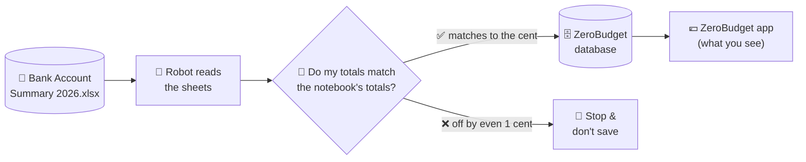
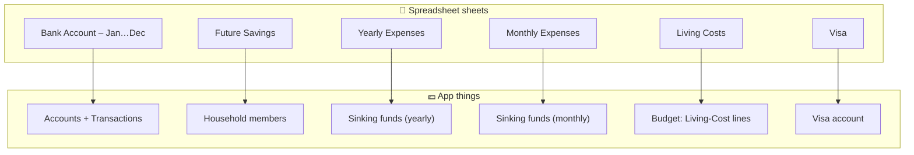
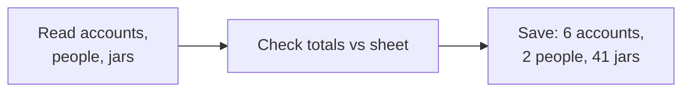
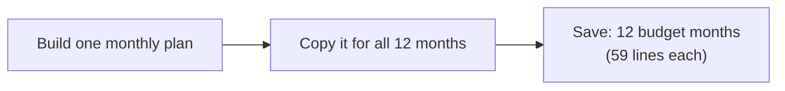
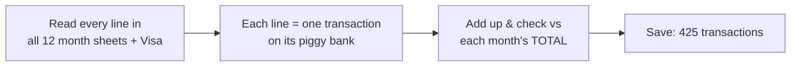
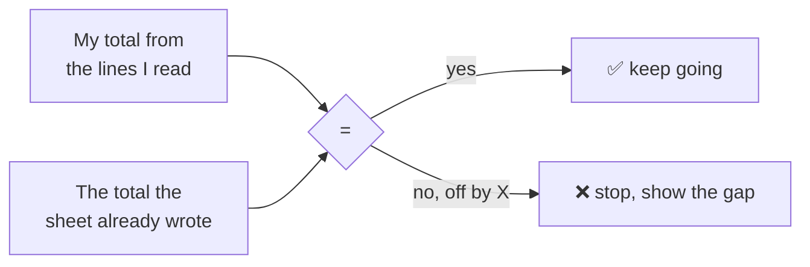
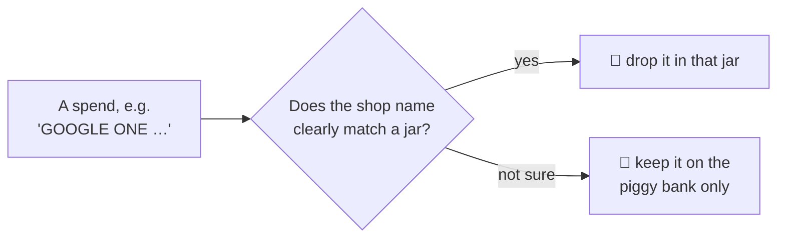

# The 2026 Workbook Importer — explained simply

This little program is a **robot that reads your big money notebook** (the
`Bank Account Summary 2026` Excel file) and **types everything into the ZeroBudget
app for you** — then **double-checks its own typing** against the notebook's own totals,
down to the last cent.

You only run it by hand, once. It is not part of the website and never runs on its own.

---

## 🧸 The 5-year-old version

Imagine mum and dad keep all their money in a big notebook.

- They have a few **piggy banks** (a spending one, some savings ones, a coins jar, and a credit card).
- They have lots of little **jars** for big things later — a *holiday jar*, an *insurance jar*, a *presents jar* — and every month they drop a few coins in each.
- Every time money moves, they **write a line** in the notebook.

The notebook is messy and hard to read. The **app** is a tidy version of the same thing.

This robot **reads the notebook and fills in the app**. After it types each part, it adds
everything up and checks: *“does my total match the total the notebook already wrote at the
bottom?”* If yes ✅ it keeps going. If no ❌ it stops and shouts, so nothing wrong gets saved.

---

## 🗺️ The big picture



The robot never *guesses* — it copies, and the spreadsheet's own "TOTAL" rows are the
answer key it marks its homework against.

---

## 🏦 Where the money lives (the accounts)

These are the "piggy banks". Each one's balance in the app now matches the spreadsheet exactly:

| Piggy bank | What it's for | Balance imported |
| --- | --- | ---: |
| Current Joint Account | day-to-day spending | €13,290.40 |
| Savings Joint Account | living-cost savings | €12,319.98 |
| Liza – Savings Account | Liza's assets | €46,033.38 |
| Chris – Savings Account | Chris's assets | €35,631.96 |
| Cash at Home | physical cash | €580.00 |
| Visa | a credit card (money you *owe*, so it's negative) | −€1,144.87 |

There are also **2 people** (Chris & Liza) and **41 saving jars** (sinking funds).

---

## 🧩 What in the notebook becomes what in the app



---

## 🪜 The three steps (and they're done in order)

The robot works in three passes, smallest first, checking its work after each one.

### Step 1 — the *things* (reference data)



The "things" that exist before any money moves: the **piggy banks** (with their starting
balances), the **people** (with their monthly pay), and the **41 jars** (each with a *target*
— how much it should hold — and how much it *started* 2026 with).

> ✔️ Checked: jar targets add up to €41,137.30 and starting amounts to €16,165.97 — exactly what the sheet says.

### Step 2 — the *plan* (budget)



A budget is the **plan for where every euro goes** each month: pay comes in (€8,411.61),
then it's shared out across living costs, pocket money, savings, and the jar top-ups —
until almost nothing is left unplanned. The same plan is made for all 12 months of 2026.

### Step 3 — the *money moves* (transactions)



Every single line where money moved — **425 of them** — becomes one transaction in the
app, attached to the right piggy bank. Living-cost spends (groceries, petrol…) are also
**tagged to their budget line** using the short codes in the sheet (`F&D`, `EE`, `SOAP`…),
so the app can show how much was spent on each.

> ✔️ Checked: after importing, all 6 piggy banks match the spreadsheet's TOTAL for every month, to the cent.

---

## 🧮 “How do we know it’s right?” (reconciliation)

This is the most important idea. The spreadsheet **already writes its own totals** at the
bottom of each sheet (the `TOTAL` row, and little "check ≈ 0" cells). The robot computes its
*own* total from the lines it read, and compares:



It’s like adding up your shopping yourself and checking it against the receipt total. If
they don’t match, you don’t pay — you find the mistake first. (That’s how we caught two real
gotchas: the spreadsheet sometimes hides a **refund as a negative number in the “money out”
column**, and the **TOTAL row isn’t always in the same place** on every sheet.)

---

## ⚠️ The one thing that’s only half-done: jar *spending*

This answers “what do you mean about fund-spending tracking?”.

Each jar should show **how much is left = money put in − money taken out**.

- 💰 **Money put in** — the monthly top-ups — is tracked **perfectly**. Every month’s plan
  budgets the right amount into each of the 41 jars.
- 🛒 **Money taken out** — the spending *from* a jar — is the tricky bit.

Here’s the snag, in kid terms: the notebook labels jar-spending only by **big group**, not by
the **exact jar**. When you buy Netflix *and* Google One *and* Disney+, the notebook just
writes `LIC` ("Licenses") on all of them — it doesn’t say *which* subscription jar. But the app
has a **separate jar for each** (Netflix jar, Google One jar, Disney+ jar… 26 jars in total).

So the robot now **guesses the jar from the shop name**: if a charge clearly matches a jar —
“GOOGLE ONE” → the Google One jar, “NETFLIX” → the Netflix jar, the loan and car insurances →
their jars — the spend is dropped into that jar. If the shop name is **ambiguous** (a pharmacy
could be any of several health jars), the spend stays on the **piggy bank only** — so we never
put money in the *wrong* jar.



Today that lands **207 of the 425** spends in a jar (all the living-cost ones, plus the obvious
yearly and monthly matches). The rest are clear on the piggy bank but left out of the jars on
purpose.

If you ever want **every** yearly spend in a jar, the alternative is to **make the app’s jars
match the notebook’s 6 groups** (Maintenance, Licenses, Accessories, Health, Gifts, Liz
Maintenance) instead of 26 separate jars — then the group codes line up exactly, at the cost of
the per-item jars (Netflix vs Google One).

Either way, **all account balances and all living-cost spending** reconcile to the cent.

---

## ▶️ How to run it

From the repo root. Each verb **reads** unless you add `--commit`, and prints a reconciliation
table you can eyeball first.

```bash
# read-only: look at a sheet, or tie reference data out to the sheet, or see what's in the DB
dotnet run --project tools/ZeroBudget.Importer -- dump "Yearly Expenses"
dotnet run --project tools/ZeroBudget.Importer -- reconcile
dotnet run --project tools/ZeroBudget.Importer -- status

# the three import steps (run in this order). --reset wipes the owner's data first.
dotnet run --project tools/ZeroBudget.Importer -- import --commit --reset
dotnet run --project tools/ZeroBudget.Importer -- budget --commit
dotnet run --project tools/ZeroBudget.Importer -- transactions --commit

# optional step 4: tag the Visa transactions with who spent what (per-person columns)
dotnet run --project tools/ZeroBudget.Importer -- members --commit
```

**Step 4 (`members`)** back-fills household-member attribution onto the already-imported Visa
transactions from the sheet's per-person columns (D = Liz, E = Chris; Marisa isn't a household
member, so her share is left unattributed). A charge wholly one person's gets a whole-transaction
member tag; a shared charge becomes per-member split slices that still sum to the total — so
account balances and budget actuals are unchanged. It needs the `AddTransactionMember` migration
applied (it auto-applies when the app runs). Safe to re-run (it resets its own tags first).

Useful flags: `--file <path>` (which workbook), `--email <addr>` (whose data — defaults to the
household owner), `--conn <string>` (which database), and `--verbose` (per-month detail when a
transaction reconciliation is off).

It’s **safe to re-run**: each step clears the previous import for that owner first, so you
always get a clean, identical result.

---

## 🧱 How the code is organised

| File | Job |
| --- | --- |
| `Program.cs` | reads the command word (`dump`, `reconcile`, `import`, `budget`, `transactions`, `members`) |
| `Workbook.cs` | opens the Excel file *even while it's open in Excel* |
| `ReferenceReader.cs` / `BudgetReader.cs` / `Ledger.cs` | read the sheets into plain data |
| `VisaShareReader.cs` | reads the Visa per-person columns (D = Liz, E = Chris, F = Marisa) for step 4 |
| `Model.cs` | the plain data shapes (account, member, fund, transaction…) |
| `ReconcileReport.cs` | the "mark my homework vs the sheet" report for step 1 |
| `ImportRunner.cs` | writes step 1 (accounts, members, funds) |
| `BudgetSeeder.cs` | writes step 2 (the 12 budget months) |
| `TransactionSeeder.cs` | writes step 3 (the 425 transactions) + reconciles |
| `MemberAttributor.cs` | writes step 4 (member attribution onto the Visa transactions) |
| `ImporterHost.cs` / `DbCommands.cs` | the database plumbing |

The whole tool is **left out of the solution build** on purpose — it’s a one-off helper, not
part of the app or its tests.
